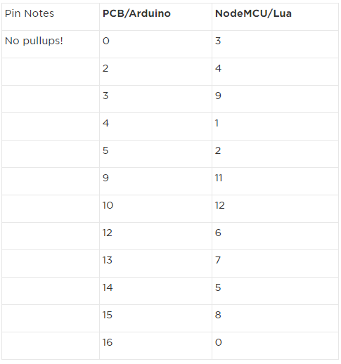

========
Umbrella
========

ESP8266 based smart umbrella for art show

Hardware
========

Prototyping is done on the `Adafruit HUZZAH ESP8266 Breakout <https://www.adafruit.com/product/2471>`_
The adafruit documentation is available here: https://learn.adafruit.com/adafruit-huzzah-esp8266-breakout/overview

The Lua pin mapping does not match the printed mapping (for Arduino). Here is the corrected version:

Software
========

The program will be written in eLua (NodeMCU) instead of Arduino because the `documentation <http://nodemcu.readthedocs.io/en/master/>`_ appears to be more concise. 

Getting Started
***************

Some quick demo code pulled from Adafruit:

Blink an LED
------------

.. code-block::

  gpio.mode(3, gpio.OUTPUT) --set the pin #0 to an output
  gpio.write(3, gpio.LOW) --Turn the LED on
  gpio.write(3, gpio.HIGH) --Turn the LED off

  
You can make this a little more automated by running:

.. code-block::

  while 1 do
    gpio.write(3, gpio.HIGH)
    tmr.delay(1000000)   -- wait 1,000,000 us = 1 second
    gpio.write(3, gpio.LOW)
    tmr.delay(1000000)   -- wait 1,000,000 us = 1 second
  end
  
Scanning WiFi
-------------
 
.. code-block:: 
  
  wifi.setmode(wifi.STATION) --set the ESP8266 into WiFi Client mode with
  
  -- print ap list
  function listap(t)
        for k,v in pairs(t) do
          print(k.." : "..v)
        end
  end

  -- OR
  -- print ap list, with more detail
  function listap(t)
        for ssid,v in pairs(t) do
          authmode, rssi, bssid, channel = 
            string.match(v, "(%d),(-?%d+),(%x%x:%x%x:%x%x:%x%x:%x%x:%x%x),(%d+)")
          print(ssid,authmode,rssi,bssid,channel)
        end
  end

  wifi.sta.getap(listap)
